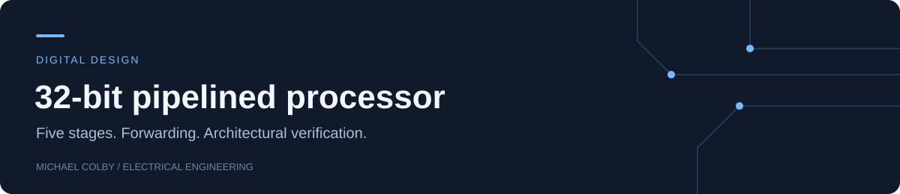

# 32-bit Pipelined RISC Processor

[](https://github.com/michaelcolby-git/risc32-pipeline/actions/workflows/verify.yml)

A five-stage Verilog processor with operand forwarding, a load-use interlock, and
branch resolution in execute. Verification compares the retirement stream and data
memory against an independent Python instruction interpreter.

| Pipeline | Verification | Clock stimulus |
|---|---|---|
| IF → ID → EX → MEM → WB | 26 scenarios; 3,000 randomized instructions | 20 ns / 50 MHz |

**[Architecture](docs/ARCHITECTURE.md) · [RTL](rtl/core.v) · [Results](results/VALIDATION.md) · [Design decisions](docs/DESIGN_NOTES.md)**

## Architecture


- EX/MEM forwarding takes priority over MEM/WB for the newest available value.
- An immediate load dependency inserts one bubble; independent ALU dependencies use forwarding.
- Store data and branch comparisons use forwarded operands.
- Taken branches flush younger instructions, including wrong-path stores.
- Register x0 remains zero; unsupported instructions and unaligned accesses raise a diagnostic fault.

| Supported instructions | Behavior |
|---|---|
| ADD, SUB, AND, OR, XOR | Register arithmetic and logic |
| ADDI | Signed 12-bit immediate; ADDI x0,x0,0 is NOP |
| LW, SW | Word-aligned 32-bit memory access |
| BEQ, BNE | Signed PC-relative branches |

The encoding follows this **RV32I subset**. The core has no full RISC-V compliance
claim, precise traps, caches, or variable-latency memory.

## Reproduce the results

Requirements: Python 3.10+ and Icarus Verilog (`iverilog`, `vvp`) on PATH.

```sh
python -m unittest discover -s tests -p "test_*.py" -v
python scripts/verify.py
```

The regression emits per-program traces, memory checks, a VCD waveform, logs, and
`build/results.json`. It returns an error if the HDL and interpreter disagree.
Windows executable paths can be supplied through `IVERILOG` and `VVP` environment variables.

## Verification results

All 26 scenarios passed locally. The directed ALU dependency chain recorded zero
stalls; immediate load-to-ALU, load-to-store, and load-to-branch tests each recorded
one. Twelve seeded programs added 3,000 randomized instructions.

IPC is reported **per workload**, counting pipeline fill, stalls, and branch flushes.
The 20 ns clock is a simulation setting, not a synthesized maximum frequency.

| Inspectable result | What it demonstrates |
|---|---|
| [Forwarding trace](results/forwarding.csv) | Back-to-back arithmetic and newest-producer priority |
| [Load-use trace](results/load_use.csv) | One-cycle interlock before dependent arithmetic |
| [Branch trace](results/branch_flush.csv) | Retirement skips the wrong path |
| [Full results](results/VALIDATION.md) | Cycle counts, stalls, flushes, and IPC |

Implementation origin and measurement scope are recorded in [PROVENANCE.md](PROVENANCE.md).
